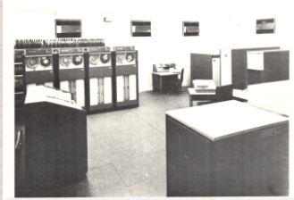

Instalação do 1° Computador na Cia Hering
Em 1969 foi criado o CETIL (Centro Eletrônico da Industrial Têxtil), ação conjunta entre Hering, Teka, Renaux, Industrial Garcia, Karsten, Cremer, entre outras, que possuía um sistema de transmissão de dados.
Em 1972 foi locado um computador do CETIL na unidade Matriz da Cia. Hering.  A demanda era grande, pois, envolviam dados dos setores financeiro-administrativo e o sistema de transmissão já não satisfazia. O modelo escolhido foi um “computador de 3ª geração” B-3500 da Burroughs, que pesava cerca de 1 tonelada e possuía 128 k de memória. A instalação desse computador gerou a criação de um Centro de Processamentos de Dados (CPD), que na época representava grande avanço tecnológico para e empresa. Com esse computador pretendia-se realizar comunicação, através de circuitos de telecomunicações da EMBRATEL entre a Matriz e outras unidades, inclusive a Hering Nordeste. A seleção de pessoas para trabalhar nesse setor aconteceu por meio de recrutamento interno, selecionando jovens de outros setores para o CPD.

